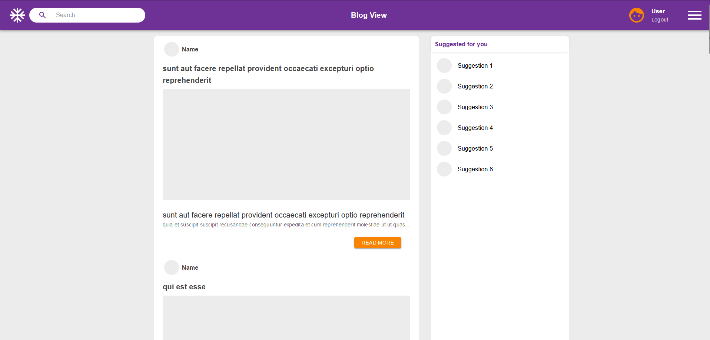

<div align='center'>
  
  <h1 >📝 Blog View</h1>
  
</div>

<div align='center'>
  
</div>

<br />

## 🚀 Introduction

Welcome to Blog View, your modern space for engaging with blog content. We use the https://jsonplaceholder.typicode.com API to deliver a seamless reading experience.

## ✨ Key Features

- **Dynamic Feed Page**: Our main feed elegantly displays all posts, highlighting titles and excerpts for quick browsing.
- **In-Depth Post Viewer**: Dive deeper by clicking on a post to reveal its full content, enriched with intuitive navigation.
- **Advanced Search Functionality**: Effortlessly find content with our powerful search feature, connecting you to the posts that matter most.
- **Responsive Across Devices**: Crafted for compatibility, our blog adjusts beautifully to desktop, tablet, or mobile screens.
- **Elegant Material-UI Design**: Experience a visually coherent interface, thanks to the integration of Material-UI components.

## 📂 Project Structure

Below is the main structure of our project:

- `src/`: Source files for the application.
- `assets/`: Static files like images and global styles.
- `components/`: All React components used in the application.
- `tests/`: Test files for the components.
- `hooks/`: Custom React hooks.
- `pages/`: Page components and tests.
- `routes/`: Routing setup for the application.
- `services/`: Services for external API calls.
- `theme/`: Material-UI theme configuration.
- `public/`: Public files.
- `build/`: Compiled and ready-to-deploy application files.
- `node_modules/`: Project dependencies.

## 🛠 Tech Stack

- **React**: A JavaScript library for building user interfaces.
- **TypeScript**: A typed superset of JavaScript that compiles to plain JavaScript.
- **Material-UI**: A popular React UI framework.
- **Vite**: A blazing fast build tool for modern web projects.
- **Vitest**: A Vite-native unit test framework that's fast and lightweight.
- **React Testing Library**: Builds on top of DOM Testing Library by adding APIs for working with React components.

## 🌟 Getting Started

These instructions will get you a copy of the project up and running on your local machine for development and testing purposes.

### Prerequisites

What things you need to install the software and how to install them:

```

node.js
npm

```

### Installing

A step-by-step series of examples that tell you how to get a development environment running:

Clone the repository:

```
git clone https://github.com/Mornieur/blog-view
```

Navigate to the project directory:

```
cd my-blog
```

Install dependencies:

```
npm install
```

Run the development server:

```
npm run dev
```

## 🧪 Running Tests

Explain how to run the automated tests for this system:

```
npm run test
```
